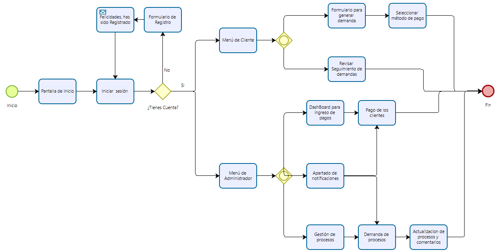

# Launch-X-Latam-AbogaBot
Practicas de Intro a Frontend - AbogaBot

**Caso: Abogabot**
Descripción:

- Es un despacho de abogados que quiere automatizar las demandas de sus clientes, esto lo harán a traves de una página web llenando un formulario.
- Al momento de llenar el formulario se manda al proceso de pago para finalizar la transacción.
- Para dar seguimiento a su demanda, el cliente crea una cuenta en la plataforma y verá el seguimiento de cada una de las actualizaciones del proceso legal.
- El administrador del sitio recbe la notificación de una nueva demanda y con los datos llenados del formulario se crea automaticamente el documento legal en formato word para empezar el proceso.
- El administrador recibe el pago y debe de ser capaz de verlo en un dashboard para ver la cantidad de ingresos recibidos.
- El administrador actualiza el proceso de la demanda y agrega comentarios en cada paso del proceso.
- Al usuario le llegan correos de notificación para saber el avance de su proceso.
- La página debe de ser responsive para poderla ver desde el celular.
- La preferncia de colores del cliente es azul marino y blanco, pero acepta propuestas.

## **Toma de Requerimientos.**

Se busca crear una página web en la cual los usuarios podrán ingresar por medio de computadora o en su defecto dispositivos móviles.

**Cliente**

- Crear formulario para el registro de las cuentas de los clientes.
- Crear cuenta de clientes.
- Método de pago para finalizar transacción.
- Ver seguimiento de las demandas y cada actualización dentro de su cuenta.
- Notificaciones para avance del proceso.

**Administrado**
- Recibir notificaciones de una nueva demanda.
- Dashboard para ingresos recibidos.
- Actualización de procesos y agregar comentarios.

**Diagrama de Flujo**

## **Buyer Persona.**

.
## **Wireframe UX**

## **UI**
